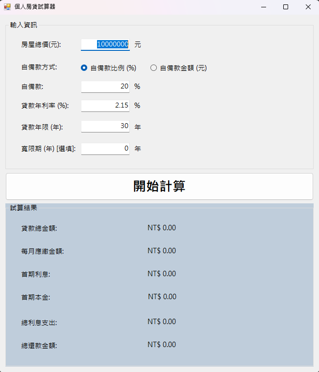
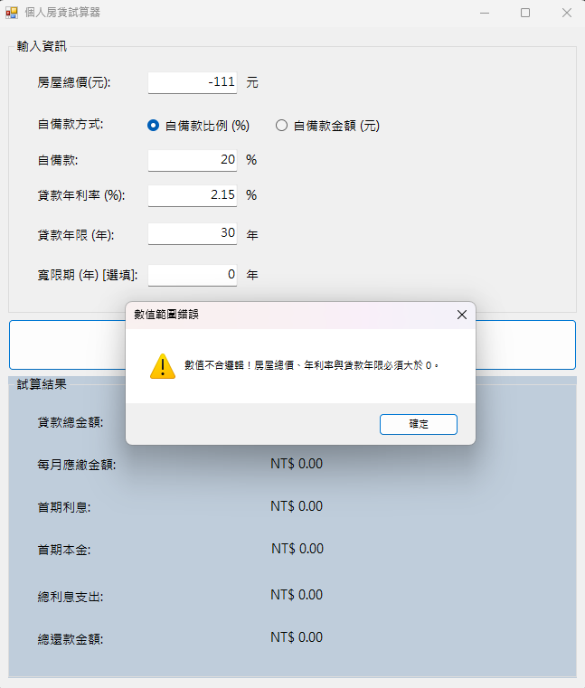

# 個人房貸試算器 (Personal Mortgage Calculator)

## 專案簡介
這是一個基於 C# Windows Forms 開發的個人房貸試算工具。本程式旨在幫助使用者快速且準確地計算房屋貸款的詳細支出，包含每月應繳金額、首期利息、首期本金、總利息支出以及總還款金額，並提供直觀的圖表視覺化呈現借款成本。

## 核心功能
* 靈活輸入：支援自備款以「百分比(%)」或「實際金額」兩種方式進行切換輸入。
* 寬限期計算：支援寬限期邏輯設定，並動態調整每月應繳金額的提示文字。
* 視覺化圖表：內建圓餅圖 (Pie Chart)，直觀顯示貸款本金與總利息的佔比。
* 例外處理與防呆：具備嚴謹的輸入驗證機制（攔截空值、非數字、負數及不合理的寬限期設定），確保程式穩定運行不崩潰。
* 數值格式化：計算結果自動採用標準財務格式（含千分位逗號與小數點後兩位）。

## 系統環境與執行說明

### 開發環境
* 開發工具: Visual Studio
* 介面框架: Windows Forms
* 程式語言: C#

### 執行步驟
1. 將本專案複製 (Clone) 或下載解壓縮至本機電腦。
2. 使用 Visual Studio 開啟專案資料夾中的方案檔 (.sln)。
3. 確認環境載入完畢後，點擊上方工具列的「開始」按鈕（或按下鍵盤 F5 鍵）進行編譯與執行。
4. 程式啟動後，依序輸入房屋總價、自備款、年利率、貸款年限與寬限期等參數。
5. 點擊「開始計算」按鈕，下方資訊區與右側圓餅圖即會顯示完整的試算結果。

## 程式執行畫面截圖

## 開發者資訊
* 學校: 元智大學 資訊工程學系 三年級
* 學號: 1123520
* 姓名: 廖子任